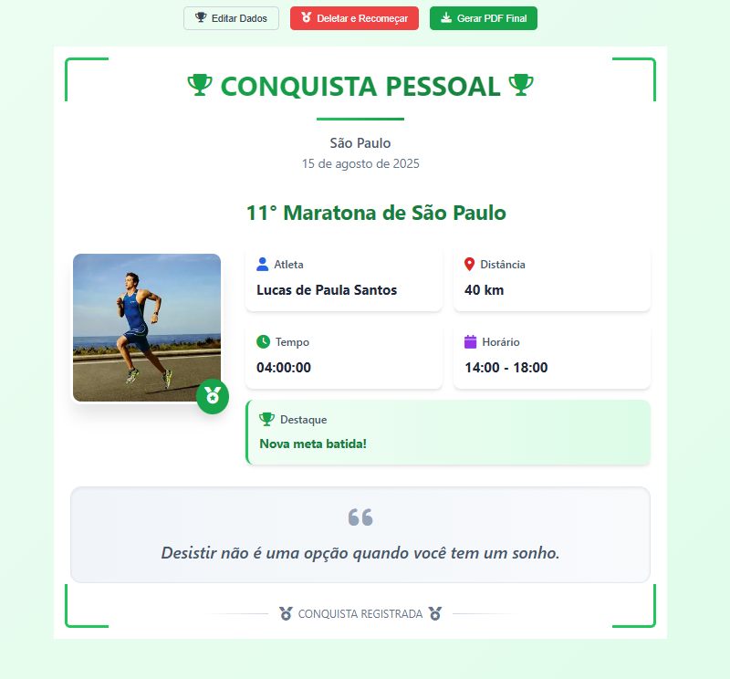

# 🏃‍♂️ Gerador de Certificados de Corrida

Um aplicativo web moderno e elegante para criar certificados personalizados de corridas em formato PDF. Desenvolvido com React e Tailwind CSS, oferece uma interface intuitiva para corredores registrarem suas conquistas de forma profissional.




## ✨ Funcionalidades

### 📝 Formulário Completo
- **Dados do Corredor**: Nome completo e upload de foto
- **Informações da Corrida**: Nome, local e data do evento
- **Métricas de Performance**: Distância percorrida com seleção de unidade (km/milhas/metros)
- **Controle de Tempo**: Horários de início e término com cálculo automático do tempo total
- **Personalização**: 15 mensagens motivacionais pré-definidas e campo para nota personalizada

### 🎨 Design Profissional
- **Quadro Elegante**: Layout inspirado em certificados com bordas decorativas verdes
- **Título Personalizado**: "CONQUISTA PESSOAL" em destaque
- **Cards Organizados**: Informações dispostas em cards com ícones coloridos
- **Responsivo**: Interface adaptável para desktop e dispositivos móveis

### 🔧 Funcionalidades Avançadas
- **Prévia Visual**: Visualize o certificado antes de gerar o arquivo final
- **Edição Flexível**: Volte ao formulário para fazer alterações
- **Controle Total**: Opção de deletar e recomeçar o processo
- **Geração de PDF**: Download automático em alta qualidade (formato A4 paisagem)

### 💡 Mensagens Motivacionais Incluídas
1. "O corpo vai mais longe do que a mente acredita."
2. "Cada passo é uma vitória."
3. "Você é mais forte do que imagina."
4. "A persistência é o caminho do êxito."
5. "Limites existem apenas na mente."
6. "Sua única competição é você mesmo."
7. "Grandes conquistas exigem grandes esforços."
8. "O impossível é apenas uma opinião."
9. "Correr é a metáfora da vida."
10. "Você já venceu ao começar."
11. "A dor é temporária, a conquista é eterna."
12. "Cada quilômetro é uma lição de vida."
13. "Supere-se a cada passada."
14. "O sucesso é a soma de pequenos esforços."
15. "Você é capaz de mais do que imagina."

## 🚀 Tecnologias Utilizadas

- **React 18**: Framework JavaScript para interface de usuário
- **Tailwind CSS**: Framework CSS para estilização moderna
- **Lucide React**: Biblioteca de ícones elegantes
- **jsPDF**: Geração de documentos PDF
- **html2canvas**: Captura de elementos HTML como imagem
- **Vite**: Ferramenta de build rápida e moderna

## 📦 Instalação

### Pré-requisitos
- Node.js (versão 16 ou superior)
- npm ou pnpm

### Passos para Instalação

1. **Clone o repositório**
```bash
git clone [URL_DO_REPOSITORIO]
cd certificado-corrida
```

2. **Instale as dependências**
```bash
# Usando npm
npm install

# Ou usando pnpm (recomendado)
pnpm install
```

3. **Inicie o servidor de desenvolvimento**
```bash
# Usando npm
npm run dev

# Ou usando pnpm
pnpm run dev
```

4. **Acesse a aplicação**
Abra seu navegador e vá para `http://localhost:5173`

## 🏗️ Build para Produção

```bash
# Gerar build de produção
pnpm run build

# Visualizar build localmente
pnpm run preview
```

## 📱 Como Usar

### 1. Preenchimento dos Dados
- Insira o nome completo do corredor
- Faça upload de uma foto (opcional)
- Preencha os dados da corrida (nome, local, data)
- Informe a distância percorrida e selecione a unidade
- Defina os horários de início e término

### 2. Personalização
- Escolha uma mensagem motivacional do dropdown
- Adicione uma nota personalizada (opcional)

### 3. Geração do Certificado
- Clique em "Gerar Prévia do Certificado"
- Revise as informações no quadro gerado
- Use "Editar Dados" para fazer alterações
- Use "Deletar e Recomeçar" para limpar tudo
- Clique em "Gerar PDF Final" para download

## 🎯 Características do PDF Gerado

- **Formato**: A4 paisagem
- **Qualidade**: Alta resolução (scale 2x)
- **Nome do arquivo**: `quadro-corrida-[nome-do-corredor].pdf`
- **Conteúdo**: Quadro completo com todos os dados inseridos
- **Estilo**: Design verde elegante com bordas decorativas

## 🔧 Estrutura do Projeto

```
certificado-corrida/
├── public/
│   └── vite.svg
├── src/
│   ├── components/
│   │   └── ui/
│   ├── App.jsx          # Componente principal
│   ├── App.css          # Estilos personalizados
│   ├── index.css        # Estilos globais e Tailwind
│   └── main.jsx         # Ponto de entrada
├── package.json
├── tailwind.config.js   # Configuração do Tailwind
├── vite.config.js       # Configuração do Vite
└── README.md
```

## 🎨 Personalização

### Cores
O projeto utiliza uma paleta de cores verde como tema principal:
- Verde primário: `#10b981`
- Verde escuro: `#047857`
- Verde claro: `#059669`

### Adicionando Novas Mensagens Motivacionais
Edite o array `mensagensMotivacionais` no arquivo `App.jsx`:

```javascript
const mensagensMotivacionais = [
  "Sua nova mensagem aqui",
  // ... outras mensagens
]
```

## 🐛 Solução de Problemas

### Erro na Geração de PDF
Se ocorrer erro na geração do PDF:
1. Certifique-se de usar um navegador moderno (Chrome recomendado)
2. Tente remover a foto do corredor temporariamente
3. Verifique se todos os campos obrigatórios estão preenchidos

### Problemas de Estilo
Se os estilos não carregarem corretamente:
1. Verifique se o Tailwind CSS está configurado corretamente
2. Execute `pnpm run build` para regenerar os estilos
3. Limpe o cache do navegador

## 📄 Licença

Este projeto está sob a licença MIT. Veja o arquivo `LICENSE` para mais detalhes.

## 🤝 Contribuição

Contribuições são bem-vindas! Para contribuir:

1. Faça um fork do projeto
2. Crie uma branch para sua feature (`git checkout -b feature/AmazingFeature`)
3. Commit suas mudanças (`git commit -m 'Add some AmazingFeature'`)
4. Push para a branch (`git push origin feature/AmazingFeature`)
5. Abra um Pull Request

## 📞 Suporte

Se você encontrar algum problema ou tiver sugestões, por favor:
- Abra uma issue no GitHub
- Entre em contato através do email: Lucas.santos.contatoempresarial@gmail.com

## 🏆 Créditos

Desenvolvido com ❤️ para a comunidade de corredores.

---

**Transforme suas conquistas em memórias duradouras! 🏃‍♂️💚**
